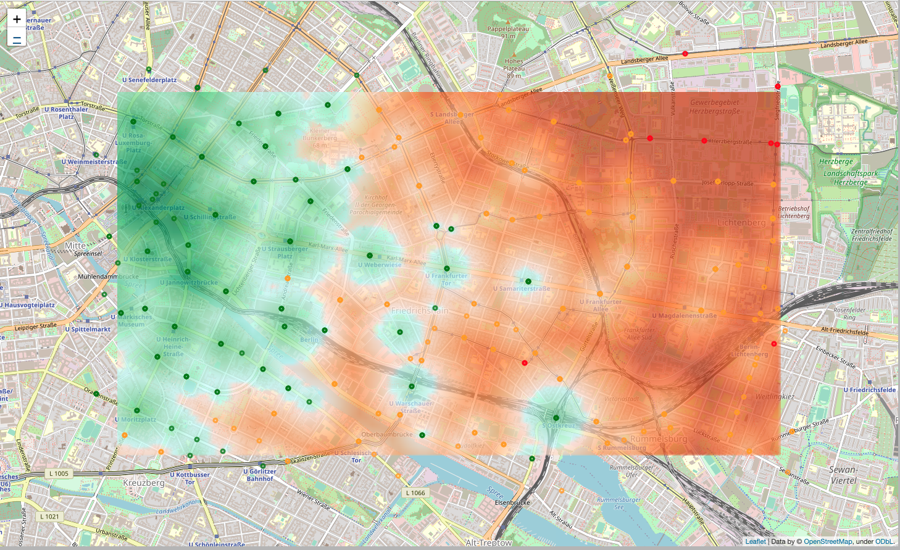

# Travel Distance Map
This Python package calculates trip options between GPS points using public transportation options.

The initial implementation will be done for Berlin and
will use [VBB test ReST API](https://www.vbb.de/unsere-themen/vbbdigital/api-entwicklerinfos/api-fahrplaninfo).


*The travel time to Alexanderplatz from different points in Friedrichshain
is visualized as a heatmap overlay with stops included in the computation shown
as colored markers.*

# How to use
This package can be used directly in your Python code.

1. Import library.
```py
from travel_distance_map import VBBAPICached, GPSPoint, Position
```
2. Instantiate an API of your choice.
```py
with open('ACCESS_ID.txt') as f:
    ACCESS_ID = f.read().strip()
    api = VBBAPICached(ACCESS_ID)
```
3. Call the API.
```py
origin = GPSPoint(52.50627, 13.33231)
dest = Position(52.5219216, 13.411026, 900100003, 'Alexanderplatz')
closest_stop = api.get_closest_stop(origin)
trips = api.get_all_trips(origin, dest)
```
4. Process the results.

Further examples can be found in [Jupyter Notebooks](travel_distance_map/notebooks).

# APIs

Currently implemented are the following APIs:
1. [VBB ReST API (Verkerhsverbund Berlin-Brandenburg)](https://www.vbb.de/unsere-themen/vbbdigital/api-entwicklerinfos/api-fahrplaninfo). Information on how to request your own API key can be found in that link.

# How to contribute

This project is looking forward to your generous contributions. Here is how you can get active:

  - **implement more APIs.**
  There are hundreds of APIs in Europe and the world. Unfortunately, there still is no central API standard for public transportation
  provider, which leaves us with the need to implement each city transport API
  from scratch.

  - **report bugs and performance issues.**
  So far this has been a hobby project, so there must be millions of ways how to
  improve this code.

  - **clone this repository and start using it.**
  Any feedback is appreciated.
